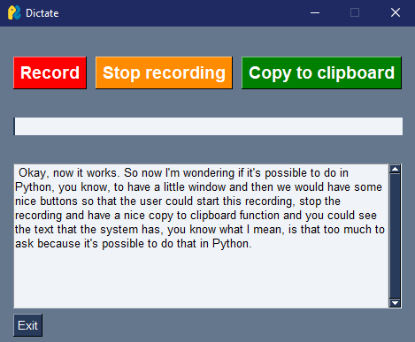

# 🎙️ Dictate your prompts

Transform your voice into text using OpenAI Whisper - a powerful speech-to-text tool that makes transcription seamless and efficient.
 

                                                                                                                                               
## 🚀 Getting Started                                                                                 

### Console Application
```bash
python dictate_console.py
```
Press ENTER to start recording, and ENTER again to stop. Your transcript will be displayed and saved automatically with a summary of its key words.

### Desktop Interface
```bash
python dictate_gui.py
```
Use the intuitive interface to record, stop, and copy your transcriptions. Monitor your audio levels in real-time through the visual meter.

Transcripts are automatically saved as `transcript_[timestamp]_[keywords].txt`, where keywords are the three most common meaningful words from your recording (e.g., `transcript_20240215_meeting_project_review.txt`).

## 📋 Installation

1. **Clone or Download** this repository.
2. **Create & activate** a Python virtual environment:
   ```bash
   python -m venv venv
   venv\Scripts\activate
   ```

3. **Install ffmpeg** as an administrator (required by Whisper):
   ```bash
   choco install ffmpeg --yes
   ```
   Or download from ffmpeg.org and add its bin folder to your PATH.

4. **Install dependencies:**
   ```bash
   pip install -r requirements.txt
   ```

## Notes

- If PyAudio fails to install, grab a wheel from Gohlke's site.
- Ensure your mic is the default input device in your OS settings.
- To silence the FP16 warning:
  ```python
  import warnings
  warnings.filterwarnings(
      "ignore",
      message="FP16 is not supported on CPU; using FP32 instead"
  )
  ```
- Do not name your script `whisper.py`—it will clash with the library.